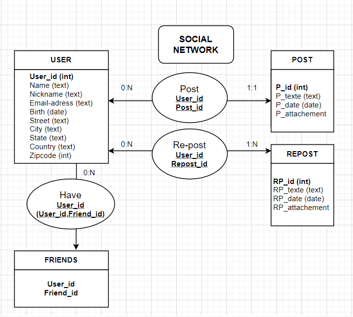

# SQL_Exercices_Telecom

Ce dossier contient des TPs effectués lors du cours de Base de Données du MS Big Data de Télécom Paris. Ils s'articulent autour de la base de données wine.db :
- créations de tables/vues
- mises à jour des tables
- requêtes SQL
- design d'une BD pour un réseau social : 

